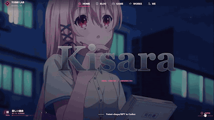
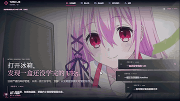
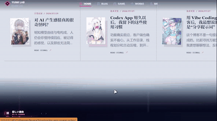
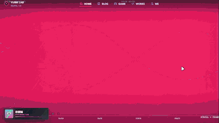
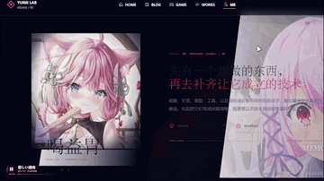

<div align="center">

<h1>
  
  Yuimi Lab
  
</h1>

**一个将二次元叙事、可玩交互与技术记录放进同一处的 Astro 个人博客。**

[在线访问](https://yuimi-chaya.github.io) · [Kisara](https://yuimi-chaya.github.io) · [Fuyukawa Kagari](https://yuimi-chaya.github.io/themes/fuyukawa-kagari/)

`Astro` `GitHub Pages` `Multi-theme` `Interactive Storytelling`

</div>

> 这里既是博客，也是持续生长的前端实验场。文章、角色、声音、场景和小游戏不必互相让路，它们一起构成 Yuimi Lab。

## 目录

- [主题一览](#主题一览)
- [Kisara：当前主舞台](#kisara当前主舞台)
- [Fuyukawa Kagari：保留完整的手账宇宙](#fuyukawa-kagari保留完整的手账宇宙)
- [二次开发建议](#二次开发建议)
- [内容与架构](#内容与架构)
- [本地开发](#本地开发)
- [媒体资源](#媒体资源)
- [写一篇文章](#写一篇文章)
- [构建与部署](#构建与部署)
- [目录说明](#目录说明)
- [许可证与素材](#许可证与素材)

## 主题一览

Yuimi Lab 不是简单换一层颜色的主题站点。每套主题都有自己的布局、样式、运行时与页面表达；它们共享文章内容，但不共享彼此的视觉逻辑。

| 主题 | 定位 | 入口 |
| --- | --- | --- |
| **Kisara** | 以木更为中心的高密度视觉交互与叙事实验。当前默认主题，承载根路由。 | [`/`](https://yuimi-chaya.github.io) |
| **Fuyukawa Kagari** | 轻盈的二次元手账与个人日记空间，保留完整的独立浏览体验。 | [`/themes/fuyukawa-kagari/`](https://yuimi-chaya.github.io/themes/fuyukawa-kagari/) |
| **Blank** | 用于保持内容与页面能力可拆分的极简主题基线。 | [`/themes/blank/`](https://yuimi-chaya.github.io/themes/blank/) |

主题间跳转采用完整页面导航，避免客户端路由、全局监听或主题样式互相残留。Kisara 的历史前缀路由仍被保留为兼容入口，而正式内容地址始终保持稳定。

## Kisara：当前主舞台

Kisara 是这个博客最具角色感的一面。它不把首页当作静态封面，而是把访问过程设计成可推进、可发现、可返回的场景序列：深靛蓝的底色、粉红和蓝色的能量、Canvas 与 WebGL 的画面层，以及围绕角色展开的路线和记忆。



### 一次访问，从进入场景开始

首页的开场由门扉、能量反馈、标题画布和自动/跳过控制共同组成。继续向下，页面并不会变成普通信息流：Opening Memory 用多层画面与记忆提示建立情绪，`002` 冰箱场景会按视频时间释放可交互物体，`Event 003` 则把照片热点、线索、成就和隐藏奖励放进一段小型调查。



这种设计的重点不是堆叠特效，而是让每个段落有明确职责。读者可以浏览最新文章，也可以停下来操作、探索，并从页面留下的细节中理解这套主题的叙事顺序。Chibi 路线和隐藏提示则把部分线索藏在不打扰阅读的细节里，给愿意多停留一会儿的人一条轻量的支线。



### 不只是博客页

Kisara 为 Home、Blog、文章页、Games、Works、About 和 Friends 分别设计了页面结构。文章页保留阅读节奏，Blog 支持筛选与检索；Works 是可以直接玩起来的操作台，Games 和个人页则继续延展角色与场景的关系。

Works 页面把标题切开、分离和重组成短暂的 Canvas 动画，并让水果切割成为可重复触发的反馈。画面里的小猪是一个低频出现、不能被直接切开的特殊目标：它会阻断刀路、受碰撞影响反弹，给操作过程留下一点意外。

### 音乐、彩蛋与可回收的秘密路线

主题拥有独立的持久音乐控制，也把部分内容放进同标签页、一次性的探索条件里。完成指定访问路线并发现线索后，Lovebrain 会开启一条单独的互动章节：滚轮、键盘和触摸可以推进画面，角色焦点、视频 scrub 和音乐共同构成这段短暂的分支体验。



这类内容不会挤占普通阅读。它们有明确的进入条件、页面模式和清理逻辑；离开后，默认首页的运行时会恢复，故事留下痕迹而不会把页面状态带到不该去的地方。Profile 与 Friends 则把这份叙事落回人物和连接本身，让站点保留一个可以安静停靠的内页。



## Fuyukawa Kagari：保留完整的手账宇宙

Fuyukawa Kagari 不是 Kisara 之前的残留版本，而是一套仍然完整、独立维护的主题。它位于 `/themes/fuyukawa-kagari/`，拥有自己的页面布局、主题资源、导航、SEO 与交互脚本。进入这个入口，就像翻开另一册个人手账：温和、轻松，也更适合慢慢浏览。


### 从手账开始，而不是从舞台开始

首页用大图 Hero、终端式打字副标题、头像和身份卡建立第一印象。日期、时间、本地信号、公告和 Tag Rain 让信息有了细微的生活感；Live2D 控制台、Yuimi Radio、樱花雨和小猪滚动条则把“个人主页”做得更像一个可停留的房间。

它的视觉语言偏向纸张与收藏：浅色手账背景上有粉色和浅蓝色的点缀，组件清晰而不过分侵占内容。和 Kisara 的强节奏叙事不同，Fuyukawa Kagari 更重视阅读、归档和日常更新的舒展感。

### 为长期记录准备的页面

Blog 使用时间线式归档，提供 Pagefind 搜索、标签与正确的主题前缀链接处理。Projects 是带技术线看板的项目陈列，可按类别筛选并展开细节；About 把资料、技术线、兴趣、XP、游戏和近况放进一份可慢慢补完的自我介绍。


Games 页面则以展示和介绍为主，保留游戏原作者、仓库与许可证信息，并明确站点只是个人展示与外链入口。这让主题的可爱外观之外，也有清晰、诚实的内容边界。

### Fuyukawa Kagari 适合什么

- 想要二次元、手账和个人主页气质，但希望文章阅读始终是中心。
- 需要时间线归档、全文搜索、项目筛选和丰富的个人资料页。
- 希望主题独立存在，并与当前默认主题共享文章而不共享实现包袱。

## 二次开发建议

### Kisara：适合拆解参考，不适合直接改造成通用主题

Kisara 包含大量 Canvas、WebGL、音频、滚动输入与页面状态驱动的动效，适合把某一个明确效果当作参考对象后独立复刻，例如标题折射、分层入场、场景切换或一次性的输入反馈。它并不适合作为通用模板直接改造：视觉、叙事、隐藏路线和运行时状态与 **Engage Kiss** 的角色设定、场景语境及相关素材深度绑定，替换素材往往不足以让整套体验自然成立。

复刻时建议先定义单个效果的输入、输出和清理时机，再使用自己的文案、素材与状态模型重写；不要把首页脚本、音频流程或角色彩蛋整体搬进新项目。这样更容易保留效果本身，也能避免主题间的状态耦合和资源负担。

### Fuyukawa Kagari：更适合作为个人站改造基底

Fuyukawa Kagari 的动效多数不依赖某一张角色图片才能成立。Hero、头像、品牌图、背景、公告与项目内容替换后，终端式副标题、樱花雨、Tag Rain、音乐播放器、小猪滚动条、时间线归档和项目筛选仍能保持完整体验，因此更适合做个人博客、作品集或手账主页的二次开发起点。

最省心的改造顺序是先替换主题资源和站点文案，再调整导航、文章分类与项目数据，最后按需要保留或关闭 Live2D、天气信号、音乐等外部或增强型功能。涉及第三方游戏、模型、音乐或图片时，也应保留原有署名、许可证与使用边界。

### 自用开发原则

- 新主题应保留独立的布局、页面、样式和运行时，不直接导入另一主题的内部实现；共享文章内容与主题切换能力即可。
- 将可替换的图片、文案、链接和播放列表集中管理，先完成素材替换，再微调动画，避免把资源路径散落在交互代码中。
- 每个视口控制动效密度：通常保留一个主动作、一个交互反馈和一个低频环境效果，文章和归档页优先保证稳定阅读。
- 每次改动交互后至少检查桌面、移动端、`prefers-reduced-motion`、主题切换与页面离开后的清理，避免动画、音频或全局监听跨页面残留。

## 内容与架构

项目使用 Astro 静态输出，文章来自同一份 Content Collection。主题各自渲染首页、列表、文章与功能页，因此同一篇 Markdown 可以拥有不同的阅读表情，而文章数据、封面和附件仍保持在主题外的共享位置。

```text
共享文章内容
    ├─ Kisara：根路由 /、/blog/、/games/、/projects/、/about/
    ├─ Fuyukawa Kagari：/themes/fuyukawa-kagari/...
    └─ Blank：/themes/blank/...
```

构建过程包含资源生成、Astro 静态构建与 Pagefind 索引。Markdown 支持 GFM、标题锚点、代码高亮和中文内容检索。

## 本地开发

**环境要求：** Node.js `24`（与 GitHub Pages 工作流一致）和 npm。

```bash
npm install
npm run dev
```

常用命令：

```bash
npm run dev       # 启动本地开发服务器
npm run test      # 运行静态回归测试
npm run build     # 生成资源并构建 dist/
npm run preview   # 预览构建产物
```

项目包含 `.npmrc`，默认使用 `https://registry.npmmirror.com/`。当前仓库已验证可在中文目录下构建；无需仅因为路径包含中文而迁移项目。

## 媒体资源

完整封面保留在 `public/blog-covers/`。构建会从已采用的 `cover-XX.webp` 生成适合缩略展示的 320、640、960px 版本，仅保留小于原尺寸且体积更小的候选；不会覆盖完整封面。首页和归档通过 `srcset` 按显示尺寸与设备像素密度选图，文章分享元数据仍使用完整封面。

```bash
npm run prepare:covers
```

替换完整封面后运行此命令，再提交生成的 `public/blog-covers/responsive/` 文件与 `src/core/content/responsive-covers.json`。候选文件名包含源文件及编码设置的哈希，不会让新图片沿用旧缓存地址；尚未进入清单的封面继续使用原图。`npm run build` 也会自动执行生成步骤。

已核实不再用于页面的封面 PNG/JPG 原件、旧人物图和生成候选列在 `scripts/lib/media-publish-policy.mjs`。构建仅从 `dist/` 排除这些明确列出的文件，保留 `public/` 原件；不会按“搜索不到引用”自动清理其他素材。若构建产物仍包含排除文件的文件名引用，构建会报错，需先核实引用或调整清单。动态拼接路径仍需要人工核对。

媒体处理前应备份原件。不要用全目录压缩替代逐项判断：首屏人物、透明边缘、文章文字截图、普通视频和滚动定位视频的质量与播放要求不同。修改媒体后，运行测试与构建，并核对真实展示效果；构建通过不等于视觉验收通过。

## 写一篇文章

在 `src/content/blog/` 下新建 `.md` 或 `.mdx` 文件即可。最小 frontmatter 如下：

```md
---
title: "文章标题"
description: "一句话摘要"
pubDate: 2026-08-18
tags: ["Astro", "Dev"]
category: "tech"
---

正文内容。
```

可选字段包括 `seoTitle`、`seoDescription`、`seoKeywords`、`updatedDate`、`cover` 与 `draft`。其中 `category` 可使用 `tech`、`anime` 或 `life`；`draft: true` 的文章不会进入正式文章列表。

## 构建与部署

```bash
npm run build
```

构建产物位于 `dist/`。GitHub Pages 工作流位于 `.github/workflows/deploy.yml`：推送到 `main` 或手动触发后，工作流会使用 Node.js 24 执行 `npm ci`、`npm run build`，并部署 `dist/`。

站点地址和静态输出配置可在 `astro.config.mjs` 中调整。若将站点发布到普通项目页而不是 `<username>.github.io` 仓库，请同步检查 Astro 的 `base` 配置和静态资源路径。

## 目录说明

```text
src/
├─ content/blog/                 文章 Markdown / MDX
├─ core/                         主题注册、路由与共享内容能力
├─ themes/
│  ├─ kisara/                    Kisara 的页面、样式与运行时
│  ├─ fuyukawa-kagari/           Fuyukawa Kagari 的独立实现
│  └─ blank/                     极简主题
├─ lib/site.ts                   站点名称、导航与通用配置
└─ content.config.ts             文章数据 schema

public/
├─ themes/                       各主题公开运行时资源
└─ readme/                       README 动图与展示资源

scripts/                         本地资源生成与优化脚本
tests/                           静态回归测试
.github/workflows/deploy.yml     GitHub Pages 部署流程
```

---

## 许可证与素材

本仓库按内容类型分别授权，不能将代码许可证理解为全部素材的使用许可：

| 内容 | 许可范围 |
| --- | --- |
| 维护者有权授权的原创代码、主题样式、脚本、测试、配置和技术文档 | [MIT](LICENSE)，允许商业使用、修改和分发，须保留版权与许可声明 |
| `src/content/blog/` 中维护者有权授权的原创文章文字及其网站发布版本 | [CC BY-NC-SA 4.0](CONTENT_LICENSE.md)，署名、非商业性使用、分享改编时遵守相同方式共享条件 |
| 文章中的原创软件代码示例 | MIT，除非另有声明；第三方代码遵循原许可 |
| 图片、截图、插画、音视频、字体、角色美术及其他媒体 | 不自动适用上述许可，详见 [第三方素材说明](THIRD_PARTY_ASSETS.md) |

复用主题前，请替换未取得使用许可的素材，或独立取得相应授权。维护者不声称拥有第三方作品的版权，也不能通过本仓库许可证代其授权；素材可下载不等于可以自由转载或商用。第三方依赖与资源已有的许可和署名要求继续有效。

---

<div align="center">

**Yuimi Lab** · 让记录有内容，也让页面有自己的情绪和玩法。

</div>
